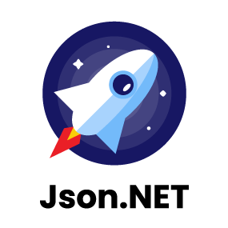

# Introduction

Json.NET is a popular high-performance JSON framework for .NET.

## Benefits and Features

- [x] Flexible JSON serializer for converting between .NET objects and JSON
- [x] LINQ to JSON for manually reading and writing JSON 
- [x] High performance: faster than .NET's built-in JSON serializers
- [x] Write indented, easy-to-read JSON
- [x] Convert JSON to and from XML
- [x] Supports [.NET Standard 2.0](https://github.com/dotnet/standard/blob/master/docs/versions.md) .NET 2, .NET 3.5, .NET 4, .NET 4.5, Silverlight, Windows Phone and Windows 8 Store

!!!success
The JSON serializer in Json.NET is a good choice when the JSON you are reading or writing maps closely to a .NET class.
!!!

LINQ to JSON is good for situations where you are only interested in getting values from JSON, you don't have a class to serialize or deserialize to,  or the JSON is radically different from your class and you need to manually read  and write from your objects.

## Getting Started

- [Serializing and Deserializing JSON](Serializing_and_Deserializing_JSON/README.md)
- [LINQ to JSON](LINQ_to_JSON/README.md)
- [Samples](samples/README.md)

## History

Json.NET grew out of projects I was working on in late 2005 involving JavaScript, AJAX, and .NET. At the time there were no libraries for working with JavaScript in .NET, so I made my own.

Starting out as a couple of static methods for escaping JavaScript strings, Json.NET evolved as features were added. To add support for reading JSON a major refactor was required, and Json.NET was split into the three major classes it still uses today: JsonReader, JsonWriter and JsonSerializer.

Json.NET was first released in June 2006. Since then Json.NET has been downloaded hundreds of thousands of times by developers from around the world. It is used in many major open source projects, including: [Mono](http://www.mono-project.com/), an open source implementation of the .NET framework; [RavenDB](http://ravendb.net/), a JSON based document database; [ASP.NET SignalR](http://signalr.net/), an async library for building real-time, multi-user interactive web applications; and [ASP.NET Core](http://www.asp.net), Microsoft's web app and service framework.

## See Also

- [Serializing and Deserializing JSON](Serializing_and_Deserializing_JSON/README.md)
- [LINQ to JSON](LINQ_to_JSON/README.md)
- [Samples](samples/README.md)